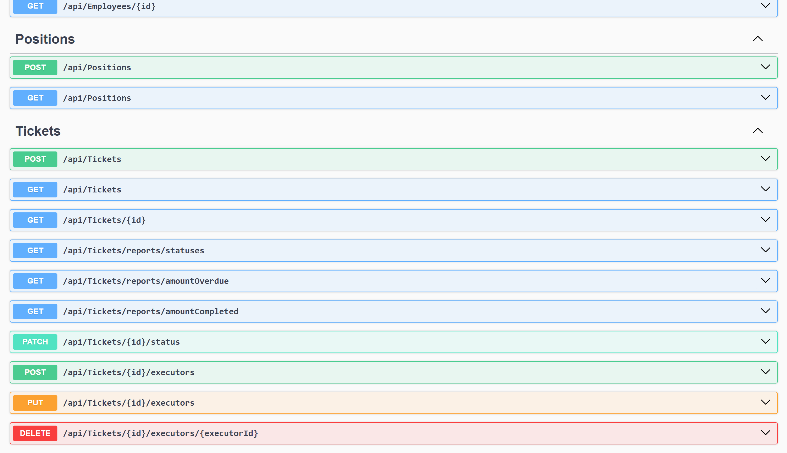
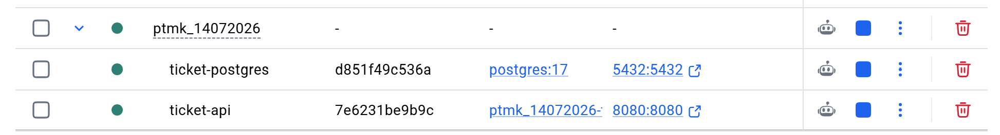
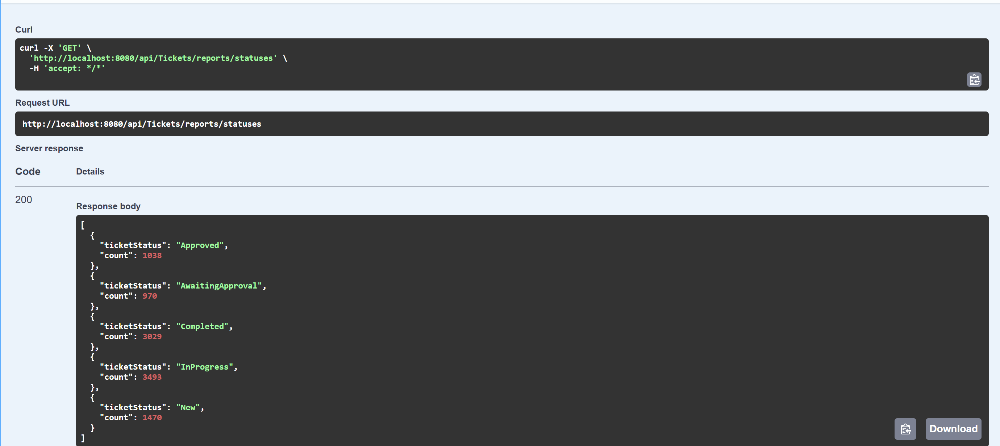
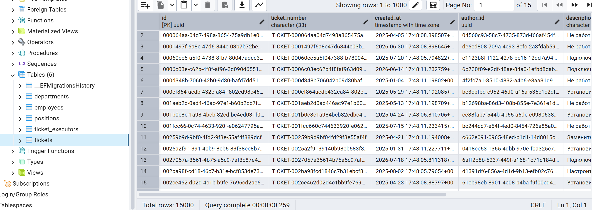
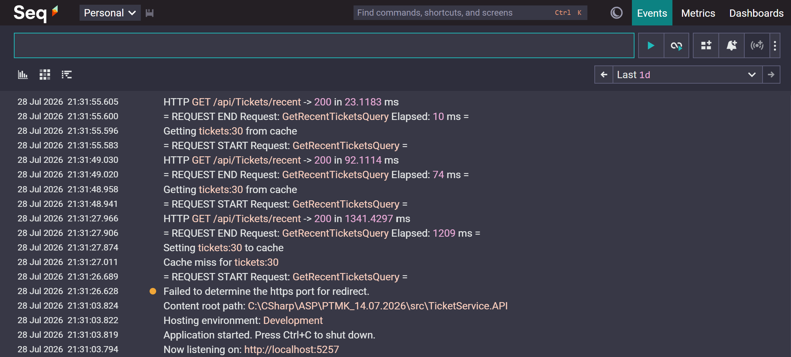

# Ticket Service

> ASP.NET Core Web API для управления заявками внутри организации.

Проект реализован как учебный pet-проект с упором на **Clean Architecture**, **DDD**, **CQRS**, **EF Core**, **Docker** и хорошую масштабируемость.

---

# Возможности

- создание заявок
- изменение статуса заявки
- назначение нескольких исполнителей
- изменение исполнителей
- фильтрация заявок
- пагинация
- отчётность
- массовая генерация тестовых данных
- автоматическое применение миграций при запуске приложения
- кэширование последних 30 заявок

---

# Архитектура

Проект построен по принципам **Clean Architecture**

```
TicketService.API
│
├── Controllers
├── Middlewares
└── DependencyInjection

TicketService.Application
│
├── Commands
├── Queries
├── DTO
├── Validators
└── Interfaces

TicketService.Domain
│
├── Entities
├── ValueObjects
├── DomainEvents
├── Errors
└── Common

TicketService.Infrastructure
│
├── EF Core
├── Repositories
├── Configurations
└── Persistence

TicketService.Seeder
```

---
# Кеширование

Для снижения нагрузки на базу данных при выполнении тяжелых отчетов используется **Redis**.
Позволяющий хранить результаты пагинированных запросов.

# Используемый стек

- ASP.NET Core 9
- Entity Framework Core
- PostgreSQL
- Docker
- MediatR
- Redis Cache
- Clean Architecture
- DDD
- CQRS
- Result Pattern
- Swagger

---

# Доменная модель

### Основные сущности

- Ticket
- Employee
- Department
- Position

### Value Objects

- TicketNumber
- CodeDepartment
- FullName

### Domain Events

- TicketStatusChanged
- TicketExecutorAdded
- TicketExecutorChanged
- TicketExecutorRemoved

---

# Реализованные отчёты

### Количество заявок по статусам

Позволяет получить количество заявок для каждого статуса.

Пример ответа:

```json
[
  {
    "ticketStatus": "Completed",
    "count": 52415
  },
  {
    "ticketStatus": "InProgress",
    "count": 10872
  }
]
```

---

### Количество просроченных заявок

Возвращает число заявок, срок выполнения которых уже истёк.

---

### Количество выполненных заявок по сотрудникам

Позволяет увидеть самых загруженных исполнителей.

Пример ответа

```json
[
  {
    "employeeId": "...",
    "employeeName": "Иванов Иван Иванович",
    "count": 152
  }
]
```

---

# Фильтрация заявок

Поддерживается фильтрация по

- автору
- исполнителю
- статусу
- типу
- периоду создания
- дедлайну
- просроченным заявкам
- коду отдела исполнителя

Также реализована пагинация.

---

# Запуск проекта

## 1. Клонировать репозиторий

```bash
git clone https://github.com/voilfas/PTMK_14.07.2026.git
```

---

## 2. Запустить Docker

```bash
docker compose up --build
```

После запуска автоматически

- поднимется PostgreSQL
- запустится API
- автоматически применятся миграции

Swagger будет доступен по адресу

```
http://localhost:8080/swagger
```

---

#  Заполнение базы тестовыми данными

Проект содержит отдельную консольную утилиту Seeder.

## Создать тестовые данные

Например

1000 заявок

```bash
dotnet run --project src/TicketService.Seeder -- 1000
```

10000 заявок

```bash
dotnet run --project src/TicketService.Seeder -- 10000
```

1000000 заявок

```bash
dotnet run --project src/TicketService.Seeder -- 1000000
```

Seeder автоматически создаёт

- Departments
- Positions
- Employees
- Tickets

---

## Очистить базу

```bash
dotnet run --project src/TicketService.Seeder -- clean
```

Будут удалены все данные из таблиц

- TicketExecutors
- Tickets
- Employees
- Departments
- Positions

---

# Скриншоты

## Swagger

> 

---

## Docker

> 

---

## Отчёт

> 

---

## База данных

> 

## SEQ логирование

> 

---

#  Производительность

Для массовой генерации данных используется пакетная вставка.

Пример:

- 1 000 сотрудников
- 1 000 000 заявок

Создаются пакетами по 5000 записей с очисткой ChangeTracker после каждой вставки, что позволяет значительно снизить потребление памяти.

---

# Что можно улучшить

В дальнейшем проект можно расширить:

- JWT Authentication
- Авторизация по ролям
- Redis Cache
- RabbitMQ
- Hangfire
- Serilog + Seq
- Unit Tests
- Integration Tests
- Kubernetes
- CI/CD

---

#  Автор

Artem Sobkalov

GitHub:
https://github.com/voilfas